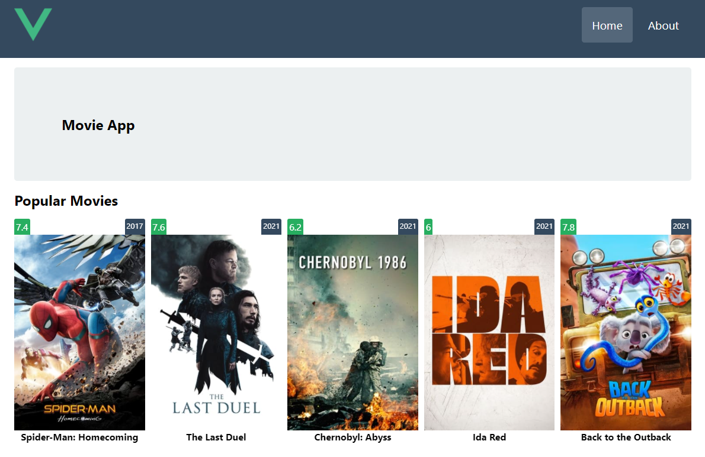
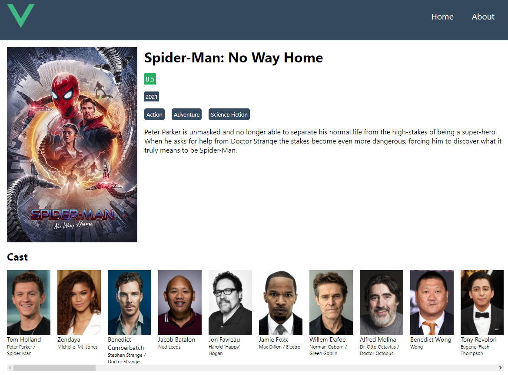

# Appcent Case

Appcent Study Case

## Run the Project

  - Clone the git repository
    `git clone https://github.com/yusufborucu/appcent-case`
  - Modify the `config/env.js` file in accordance with your [TheMovieDB](https://developers.themoviedb.org/3/getting-started/introduction) API settings.
  - Install required packages by running; `npm install`
  - Compiles and hot-reloads for development
    `npm run serve`
  - Compiles and minifies for production
    `npm run build`

## Screenshots

### Home

### Movie Detail

